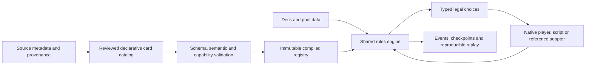

# RFC 0003: Data-driven cards and reusable mechanics

Status: **Architecture design for implementation; not delivered capability.**
Operator direction, 2026-10-09. This refines the
[current engine-validation plan](../programs/engine-validation.md).
[Operations #241](https://github.com/pabloxrl/mtg-lab/issues/241) registers bounded
implementation work after the existing M2 baseline. No RL work is introduced.

## Decision and acceptance contract

Use a versioned **declarative card catalog**, compiled at load time into immutable,
typed ability programs, executed by the existing Rust rules engine. Cards describe
what they are and what their abilities do. The engine implements the mechanics
and the timing, choices and interactions that give those abilities meaning.

**A card composed entirely of supported mechanics must be playable by adding its
definition and deck/pool data, without changing or recompiling engine or player
code.** A genuinely new mechanic requires a reusable engine implementation and
rules-derived tests, after which all valid definitions using it become executable.
Do not substitute a per-card Rust handler, callback name or allowlist for this
contract. A catalog reload may compile data to internal instructions; it must not
compile native card-specific code or require a new engine binary.

The decisive test freezes an engine binary and its hash, then introduces cards
whose identities were absent at build time. The unchanged binary loads, casts,
activates, resolves and replays those cards through normal game interfaces. The
only changes are card/deck definitions and independently justified test inputs.
The release's frozen twenty-card pool remains a qualification workload, not a
hard limit on the engine's representation.

## What exists and what must change

- [Card metadata](../../data/cards/foundations_micro_v1.json) records source pins,
  characteristics and reserved per-card behavior IDs. It is not an executable
  ability catalog; importing a keyword or rules-text string does not grant support.
- [CardId](../../crates/mtg-core/src/objects.rs) is a `u8` index into a compiled
  identity table. It cannot admit previously unknown runtime definitions.
- [Definitions](../../crates/mtg-core/src/card_definitions.rs) select behavior in
  Rust by card key. Keywords share [combat rules](../../crates/mtg-core/src/combat.rs),
  but `PowerCreature`, `InvokerCreature` and named
  [trigger kinds](../../crates/mtg-core/src/triggers.rs) bundle card-specific behavior.
- [Activations](../../crates/mtg-core/src/activation.rs) carry `power`/`invoker`
  flags. [Semantic actions](../../crates/mtg-core/src/actions.rs) identify an
  activation source without a general ability identifier. A creature with two
  activated abilities needs two distinct legal choices, not source-based guessing.
- Effective characteristics, snapshots, observations, policy choices, recorders
  and reference bridges all depend on these interfaces. Migrating only card
  definitions would leave hidden card-specific execution paths.

Retain the authoritative rules kernel, object incarnation tracking, strict input
validation, deterministic work continuations and regression evidence. Replace
card-specific dispatch incrementally rather than building a second rules engine.

## Architecture



The catalog authoring format is strict JSON with an explicit schema version.
Choose one canonical format now; editors or importers may generate it later.
Source metadata and executable definitions are separate, linked by stable identity
and hashes. Rules text, display names, art and printing information are provenance
or presentation data, never runtime instructions. A source update cannot silently
change a reviewed executable definition. Imported metadata is not automatically a
complete executable definition: authoring records how each rules-relevant source
clause maps to the typed program and flags anything unmapped. The publication
validator rejects incomplete mappings. Human review and independent tests establish
semantic fidelity; syntax/type checks cannot prove that authored effects match
card text. This authoring check is not a runtime whitelist of recognized card IDs.

Load and validate a catalog before creating games. Lower it to typed Rust data:
compact keyword sets, interned type/subtype IDs, event subscriptions, cost plans,
target/choice descriptors and effect instructions. Parse no JSON and match no card
names in the hot rules path. Share the immutable registry between games; mutable
game objects reference definitions and hold only game-specific state.

Implement a small typed instruction interpreter over the existing work executor,
not a general scripting VM. Instructions may suspend for a real player choice or
bounded work quantum and resume with owned, serializable state. No arbitrary
scripts, host calls or user-supplied loops are permitted. Finite set iteration and
explicit choice constructs are enough for the scoped cards. Extending the
instruction set is reviewed engine work with explicit semantics and tests.

## Catalog and runtime identity

A catalog contains:

| Record | Meaning |
| --- | --- |
| Catalog header | Schema version, rules revision, definition-set digest and compiler/semantics compatibility requirements. |
| Card definition | Stable card key, definition revision/content digest, source pins, printed characteristics and ability definitions. |
| Token definition | The same characteristic/ability model, separately marked as a token; token creation refers to this definition. |
| Ability definition | Stable ability ID within the card revision, kind, timing/event predicates, costs, choices/targets and effect program. |
| Pool/format and decks | Separate versioned data selecting definitions and legality constraints; not a second implementation-support allowlist. |

Use a stable `CardKey` externally and a registry-local `CardDefId(u32)` internally,
with checked capacity. Ability IDs are explicit stable strings in authoring data
and compact registry-local indices at runtime. Reordering JSON records or adding
another card must not change a card's semantic identity. Hash canonical typed
content with defined ordering; never depend on hash-map iteration or source-file
whitespace. Definition hashes include executable content and relevant provenance.

A `Game` owns a reference to its immutable registry; objects hold a definition
index plus their existing physical identity/incarnation. Ability instances retain
source incarnation, definition/ability identity, controller, event context,
choices and last-known information where the rule needs it. They are not pointers
that accidentally follow a card through a later zone change.

Snapshots and replays pin engine semantics, schema, catalog digest and referenced
definition/ability digests. Resolve local indices through that exact registry;
never interpret an old numeric ID in a newer catalog. Cosmetic metadata may be
stored separately; semantic changes create a new revision. Missing or incompatible
catalogs produce explicit errors. No hot replacement of definitions during a game.

## Definition language

The following is illustrative **proposed v1 JSON**, not an implemented schema or
copy-paste command. This synthetic card is an admission test, not a new release
card or a claim about an existing printed card:

```json
{
  "schema_version": 1,
  "card_key": "test:sky-adept",
  "revision": 1,
  "characteristics": {
    "name": "Sky Adept",
    "mana_cost": {"generic": 2, "colored": {"U": 1}},
    "colors": ["U"],
    "types": ["creature"],
    "subtypes": ["test-creature"],
    "power": 2,
    "toughness": 3
  },
  "abilities": [
    {"id": "flight", "kind": "keyword", "keyword": "flying"},
    {
      "id": "grow-power",
      "kind": "activated",
      "costs": [{"kind": "mana", "generic": 1}],
      "targets": [],
      "effects": [{
        "op": "modify_characteristics",
        "subject": {"ref": "source_incarnation"},
        "power_delta": 1,
        "toughness_delta": 0,
        "duration": "until_end_of_turn"
      }]
    }
  ]
}
```

Changing its name, size or mana cost, giving a different creature flying, or
combining flying with a supported activated power boost must not require another
Rust variant. Colors, types and abilities are explicit typed fields: do not infer
flying from a "power creature" class or an ability from a display name. Printed
mana cost and a spell's additional casting costs have separate fields.

Ability kinds are keyword, activated, triggered and static; instant/sorcery spell
programs have analogous targets, modes, additional costs and ordered effects.
Basic land subtypes receive their rules-defined mana abilities through the shared
rules kernel; the data compiler validates conflicting/duplicate encodings rather
than pretending mana abilities come from the land's name.

The initial vocabulary covers the frozen pool's mechanics:

| Family | Typed operations / descriptors |
| --- | --- |
| Characteristics | Types/subtypes/colors, numeric base power/toughness, keyword grants; current effective characteristics queried by rules. |
| Costs | Colored/generic mana, tap this permanent, discard a selected eligible hand card; ordered/atomic payment contract. |
| Events | Spell committed as cast, object entered the battlefield; predicates over actor, controller, types and source identity. |
| Choices | Modes, typed object/player targets, ordered selections and payment choices; distinct target groups and cardinalities. |
| Effects | Produce mana for a typed recipient with explicit color/amount (or a supported color choice), deal damage with an explicit source, draw cards, create named token definitions, modify power/toughness, grant supported keywords. |
| Expressions and sets | Literals, source/controller, chosen targets, opponents, controlled creatures, current power; typed source/LKI references and finite selections. |
| Lifetime | One-shot effect, until end of turn, or supported continuous static effect while its source is active. |

Do not call this a complete Magic language. Replacement/prevention effects,
copy effects, characteristic-defining expressions, alternative costs, arbitrary
zone permissions and unsupported layer dependencies need explicit new semantics
before admission. The schema reserves versioned extension points, not silently
accepted fields that do nothing. Initial static/continuous support is bounded by
the scoped grants/modifiers; broader static effects remain unsupported.

Existing special cases become compositions. For example:

- A noncreature-spell trigger that damages each opponent is an event predicate
  plus a non-targeting opponent-set damage effect; it is not an `Archer` opcode.
- A creature's self-boost on a cast event uses the same predicate and a temporary
  modifier on the captured source incarnation; it is not a `Cyclops` opcode.
- Entering-the-battlefield damage to a chosen player uses an ETB event, a player
  target group and damage with a parameter; it is not a `Pyromancer` opcode.
- A mana creature, flying creature and activated ability are independent features
  that may coexist. Mana abilities use the kernel's mana-ability timing rules,
  not an author-supplied flag that can incorrectly bypass the stack. For example,
  a tap cost plus `produce_mana(recipient=ability_controller, output={G: 1})`
  expresses a green mana creature. Derive mana-ability eligibility from the shared
  targeting/effect/timing rules; reject unsupported forms. The output is data,
  never a color selected from the creature's name.

## Rules remain in the engine

Data specifies semantic intent; it cannot override the Magic execution protocol.
The rules kernel owns legality, timing, priority, stack ordering, payment commit,
state-based actions, trigger placement, APNAP ordering, combat and cleanup.

Ability-active zones are part of the definition contract. In v1, scoped permanent
activated, triggered and static abilities are active on the battlefield by default;
abilities requesting unsupported alternate-zone permissions are rejected at load.
A card in hand or a graveyard cannot activate a battlefield ability or subscribe
to its cast events. Printed keywords remain characteristics in rule-relevant
zones; legality still checks the object's zone. Instant/sorcery programs execute
on stack resolution, not merely because their definition is loaded.

For entering-the-battlefield events, the atomic zone transition makes the arriving
object and its active abilities available to event detection, so its own ETB
trigger is captured. Capture qualifying event context before later state-based
actions can remove the source; placement on the stack still follows shared rules
and APNAP ordering. Leaving the active zone removes future subscriptions, not
already-created pending/stack abilities. Use pre/post-event or last-known views
where the implemented rule requires them; leave-the-battlefield and other
look-back triggers are unsupported until their detection semantics are implemented.

Targets are declared at the correct announcement/trigger-placement step and
rechecked at resolution. Costs commit before cast/activation events and are not
ordinary effect instructions. Losing a target, missing all targets, source death,
last-known information and partial resolution follow shared rules. Dealing damage
is not interchangeable with subtracting life; it must preserve source identity and
produce the appropriate damage events. Choices discovered during resolution
suspend the same typed work executor rather than inventing priority windows.

Define binding time for every selector/expression: event time, announcement time,
resolution time or continuous evaluation. A spell affecting controlled creatures
at resolution captures the applicable set at that point; an ongoing static effect
recomputes its affected set. This distinction cannot be left to accidental iterator
behavior. Source references distinguish the original incarnation from a newly
returned object. Triggered and activated abilities on the stack retain the
required context even when their source leaves play.

All keyword checks query **effective** characteristics, not just printed flags.
The first implementation handles the layer interactions required by the current
pool's temporary boosts, haste and trample and the reusable flying tests. Gaining
or losing an ability must affect the same shared combat/legality queries. Define
modification timestamps, affected-object binding and cleanup expiry explicitly.
Do not claim a general layer/dependency evaluator before implementing and testing
it; reject definitions requiring unsupported operations or ordering semantics.

## Admission, choices and support claims

Validation has four stages:

1. Parse strict schema: reject unknown fields/opcodes, malformed identity,
   duplicate ability IDs, invalid numbers and unresolved definition references.
2. Type-check costs, selectors, targets, expressions and effects, including
   lifecycle/binding rules, reference scope and finite program/resource bounds.
3. Derive required mechanics and interaction features from the program. Check
   them against the engine's versioned supported semantics, not an author-asserted
   `supported: true` or a whitelist of known card names.
4. Compile a deterministic registry and admission report with precise unsupported
   capability paths. Validate selected decks/pools before mutating game state.

Known opcodes are necessary but not always sufficient: a definition requiring an
unimplemented replacement interaction is rejected structurally with that reason.
Conversely, combinations within the declared supported semantics cannot require
per-card enablement; if such a card behaves incorrectly, it is an engine defect,
not permission to add a hidden blacklist. Mechanic implementation, executable
card admission, tested interactions and release qualification are separate claims.
A newly admitted card can run immediately without claiming that every possible
interaction has already been independently verified.

The engine derives legal actions from loaded abilities. An activation includes
both source object and ability ID; a trigger instance includes source, ability ID
and event occurrence. Observations expose authorized typed choice descriptions,
target groups and effect features, not card-specific command strings. Order candidates by stable semantic object/ability
identity, never incidental registry indices or hash-map order; adding an unused
definition must not perturb choices or seeded play. Native
random/heuristic players choose from those generic legal choices. A new definition
must not require editing the policy's supported-card list or its action encoder.
Scripts, snapshots, recorders and Forge/XMage adapters use the same stable ability
references, with declared protocol versions and privacy boundaries.

Return distinct errors for invalid definition, unsupported mechanic/interaction,
invalid deck/pool, illegal player action and execution failure. No fallback to a
vanilla creature, ignored ability, automatic pass or copied expected state.

## Migration and delivery gates

Complete the existing M2 baseline and keep its evidence. Then register these
bounded architectural deliveries under #241 before expanding the card pool or
qualifying the new reference-game corpus. The plan's E1a gate owns their combined
acceptance; individual implementation tasks must be split further where needed.

| Order | Deliverable | Required evidence |
| --- | --- | --- |
| A1 | Strict schema, runtime registry, dynamic identities and data-driven pool/deck loading | Unknown identities load without recompilation; malformed/unsupported definitions fail before game mutation; deterministic digests and capacity checks. |
| A2 | Characteristics, keywords and generic cost/target/effect execution | Cross-definition flying/reach, buffs, mana, damage, draw and tokens through normal game paths; multiple independent abilities on one card; positive/negative interaction tests. |
| A3 | Generic event subscriptions, trigger context and continuous effects needed by the pool | Replace named trigger/activation cases; verify cast versus resolution, ETB, target invalidation, source death/incarnation, expiry and relevant keyword combinations. |
| A4 | Complete protocol/player/recorder/snapshot/reference integration | Every legal ability is representable; no card-name policy dispatch; reload/replay preserves choices and checkpoints; explicit artifact migration/rejection. |
| A5 / E1a | Admit all frozen cards declaratively and prove data-only expansion | Fixed binary executes independently authored, previously unseen definitions; all existing regressions, reference cases, full toy-deck games and admission negative controls pass. |

At each step retain legacy behavior behind an explicit transitional adapter only
where needed; declare which path is under test. No silent fallback from an unknown
new definition into old per-card dispatch. A5 removes production dependence on the
compiled card allowlist and named card-effect variants for the scoped mechanics.
New mechanic implementations remain allowed; new **card-specific** execution paths
are not the extension mechanism.

Inventory serialized CardId values, snapshots, semantic action versions, policy
choice encodings and record formats before changing them. Version breaking changes.
Provide a tested migration where semantics can be preserved, otherwise explicitly
reject old artifacts and retain the pinned old runner/catalog for historical
reproduction. Preserve the original golden evidence and independent expected
outcomes; never silently regenerate fixtures to match a changed implementation.
Compare semantic histories/checkpoints across old and new paths; byte equality is
required only within the versioned contracts that promise it.

## Tests that prove the design

- Build once, hash the binary, then add a new catalog and deck/pool data in a
  separate step. Play unseen identities with changed mana costs, sizes and colors.
  Tests themselves must not register a special Rust handler or mutate engine state
  to simulate the ability being tested.
- At least two new flying definitions with different characteristics use identical
  blocking rules; include a supported combination with an activated boost and a
  creature with two independently selectable activated abilities. Add a new
  triggered-damage definition with different parameters to expose hard-coded
  target, damage amount or source assumptions.
- Exercise gained/lost flying and shared effective-characteristic queries in
  independently specified tests once those operations are admitted. Unsupported
  definitions requiring unimplemented effect ordering must fail before play.
- An unseen mana creature produces its declared color/amount through the same
  cost and mana-ability rules, including payment-window use and no incorrect
  stack/target bypass. Prove that cards in hand/graveyard cannot activate battlefield
  abilities or trigger on another cast; own-ETB triggers are captured once, and
  source removal does not erase an already-created ability.
- Reordering catalog records, changing display names or adding an unused definition
  leaves normalized semantic behavior unchanged. Artifact digests change according
  to the declared contract; incompatible snapshots cannot accidentally deserialize.
- Negative controls: unknown opcode, unsupported interaction, bad reference,
  duplicate ability ID, invalid cost/target, over-budget program and missing pinned
  catalog. Never silently narrow legal choices or leak hidden data to a selector.
- Preserve the current frozen-deck suite, replay/privacy/recording tests, independently
  authored rules cases and real reference comparisons. Add mutation checks that
  remove a keyword, alter a target role or change a damage parameter and show that
  the verifier detects the change. No claim of correctness from card count alone.

Benchmark catalog load/validation separately from game execution, and compare the
same frozen games before/after the migration with capture enabled and disabled.
Report memory per catalog/game, legal-choice and trigger-dispatch cost, replay time
and end-to-end throughput. Share immutable definitions and index event subscribers;
avoid scanning the entire catalog on every event. These are design choices, not
an unmeasured performance promise or permission to weaken correctness.

## Alternatives and boundary

| Alternative | Decision |
| --- | --- |
| Per-card Rust classes or generated Rust handlers | Rejected as the extension mechanism: adding a supported-mechanic card still rebuilds or changes engine code. |
| Keyword/property table alone | Insufficient for targets, costs, triggered/activated abilities and composed effects. |
| Arbitrary Lua/Python/card scripts | Deferred: increases runtime, determinism, continuation, validation and testing complexity without serving the scoped pool better. |
| General natural-language card-text interpreter | Out of scope: source text is not a reliable executable specification. |
| Typed declarative programs lowered to Rust-owned instructions | Selected: data-only card admission, shared semantics, deterministic replay and explicit capability rejection. |

This design makes adding a supported-mechanic card a catalog operation. It does
not make a new mechanic free, infer all future rules interactions, change the
frozen release decks, promise arbitrary-format support or introduce learning APIs.
